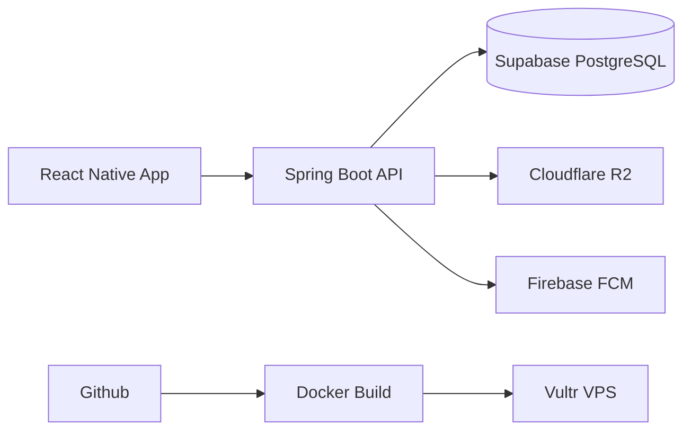
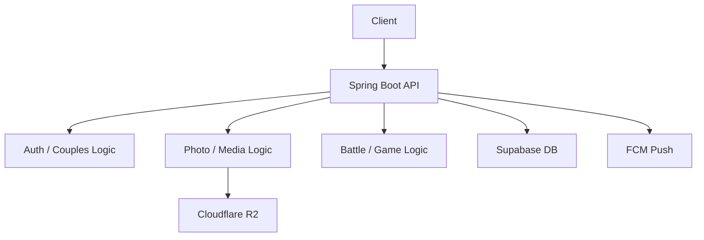
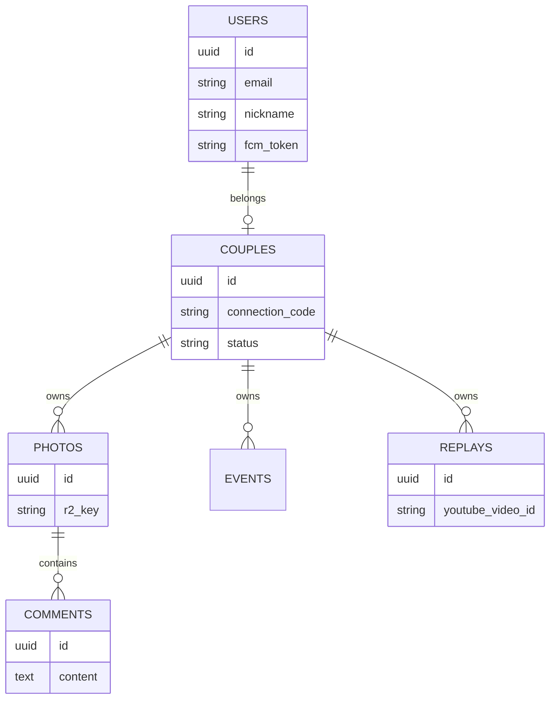

---

# 🎮 SavePoint (세이브포인트)

> **Vultr VPS와 Cloudflare R2를 활용한 백엔드 인프라 구축 및 게이머 전용 아카이빙 플랫폼**

SavePoint는 게이머 커플/듀오를 위한 상태 공유 및 미디어 아카이빙 백엔드 시스템입니다.

---

## 📅 Project Overview

| 항목 | 상세 내용 |
| :--- | :--- |
| **개발 인원** | 개인 프로젝트 (1인 개발) |
| **주요 역할** | 백엔드 아키텍처 설계, REST API 구현, 클라우드 인프라 배포 및 비용 최적화 |
| **서비스 환경** | 모바일 앱 (Android 우선 지원 / iOS 추후 지원 환경) |
| **소스 코드** | [Backend Repository](https://github.com/MMOUMCS/SavePointBack_ver1.0.0) / [Frontend Repository](https://github.com/MMOUMCS/SavePointFro_ver1.0.0) |

### 🎯 핵심 개발 목표
1. **비용 효율적인 인프라 구축:** AWS 프리티어 만료 이후를 고려하여, VPS와 가성비 스토리지를 활용한 실사용을 고려한 독립 배포 환경을 경험하여 비용 감축과 높은 성능 목표로 합니다.
2. **안정적인 도메인 설계:** 게이머 커플 간의 유기적인 데이터 흐름을 다루며, 확장 가능하고 백엔드 API 구조를 확립합니다.
---

## 🛠️ 기술 스택 & 인프라

### 🖥️ Backend & Database

* **Framework:** Java 17 / Spring Boot 3.4.5 (Build: Gradle)
* **Database & Auth:** Supabase (PostgreSQL)
* **API Docs:** Springdoc-OpenAPI (Swagger UI)

### 기술 선택이유
Spring boot : 
Java 기반 백엔드 개발 경험을 쌓기 위해 선택했습니다.
풍부한 레퍼런스와 문서가 존재하여 개인 프로젝트에서도 빠른 개발이 가능했습니다.

Supabase :
PostgreSQL 기반 데이터베이스를 빠르게 구축하기 위해 사용했습니다.
관리형 서비스이므로 DB 운영 부담을 줄이고 애플리케이션 개발에 집중할 수 있었습니다.

Cloudflare R2 : 
이미지 저장소가 필요했고,
AWS S3 대비 호출/다운로드 비용이 발생하지 않아 장기 운영 비용을 절감할 수 있다고 판단했습니다.

Vultr VPS :
AWS 프리티어 종료 이후에도 낮은 비용으로 서버를 운영하기 위해 선택했습니다.
Docker 기반으로 애플리케이션을 배포하여 환경 일관성을 유지했습니다.

#### 📸 API 
<summary>📸 핵심 API 명세서 (Swagger) 스크린샷 보기</summary>
<table width="100%">
  <tr>
    <td width="33.3%" align="center" valign="top">
      
    </td>
    <td width="33.3%" align="center" valign="top">
      
    </td>
    <td width="33.3%" align="center" valign="top">
      
    </td>
  </tr>
</table>

## 중요 API 상세

### 👥 Couple API
커플 상대 정보를 조회합니다.
```json
📍 GET /api/v1/couples/partner
```
##### Response

```json
{
  "id": 5,
  "name": "bunny",
  "profileImageUrl": "https://..."
}
```

### 👥 Battle API
배틀 데이터 정보를 조회합니다.
```json
📍 GET /api/v1/battles
```
##### Response

```json
[
    {
        "id": 22,
        "userId": "fox.test01@gmail.com",
        "gameName": "LOL",
        "result": "WIN",
        "playDate": "2026-06-12",
        "playTime": 35,
        "kills": 2,
        "deaths": 0,
        "memo": "WIN\n",
        "createdAt": "2026-06-12T14:40:44.783191"
    }
]
```

### 👥 Picture API
사진 정보를 업로드/조회합니다.

```json
📍 POST /api/v1/photos
```
##### Response 201 Created

```json
{
  "id": 8,
  "coupleId": 2,
  "uploaderId": 4,
  "s3Key": "photos/2/.../.jpg",
  "imageUrl": "https://...",
  "caption": null,
  "createdAt": "2026-06-12T17:44:12.7138392",
  "thumbnailUrl": "https://...",
  "commentCount": 0
}
```
조회
```json
📍 GET /api/v1/photos
```
#### Response 200 OK

```json
{
  "id": 8,
  "coupleId": 2,
  "uploaderId": 4,
  "imageUrl": "https://...",
  "commentCount": 0
}
```


### 📱 Frontend & Cloud

* **Frontend:** React Native (Expo)
* **Compute:** Vultr VPS (Ubuntu OS) / DOCKERFILE
* **Storage:** Cloudflare R2 (S3-Compatible)
* **Notification:** Firebase Cloud Messaging (FCM)

---

## 🦾 Core Features (기능 명세)

* **배틀 로그 관리 API:** 주요 게임(LoL, 발로란트, 오버워치2, FF14 등) 전적 결과, KDA, 메모 데이터를 적재하는 전적 API 구현.
* **커플 연동 시스템:** 고유 `connection_code` 기반의 매핑 로직을 통해 커플 상태(`ACTIVE`, `PENDING`) 관리 및 일정(`events`) 데이터 공동 처리.
* **유튜브 링크 연동 기반 아카이브:** 대용량 영상 업로드 리소스를 절감하기 위해 유튜브 고유 ID(`youtubeVideoId`) 파싱 및 썸네일/조회수 상태 동기화 API 구현.
* **Cloudflare R2 사진 앨범:** 커플 공동 앨범 사진 저장을 위해 S3 호환 스토리지인 Cloudflare R2 연동 및 댓글(`comments`) CRUD API 구축.
* 캘린더, 배틀데이터, 사진, 리플레이는 React Query를 이용하여 5분간 캐싱하여 저장합니다. (DB호출 감소목적). 단, 데이터에 변경(생성/수정/삭제 등)이 발생할 경우 바로 재호출을 합니다.
* 자동 로그인을 제공하기 위해 AsyncStorage를 이용하여 로그인 데이터를 저장합니다. 이후 프론트에서 사용자의 정보(닉네임, 프로필 이미지, 이메일 등)을 빠르게 가져옵니다. 

---
## 🔄 시스템 흐름

1. 사용자가 React Native 앱에서 요청
2. Spring Boot API가 요청 처리
3. 데이터는 Supabase(PostgreSQL)에 저장
4. 이미지/미디어는 Cloudflare R2에 저장
5. 알림은 Firebase FCM으로 전송


## 🗄️ Database Architecture

* **`users` / `couples`:** 유저 정보(`email`, `fcmToken`) 및 초대 코드를 통한 커플 매핑 구조 설계.
* **`battle_data` / `game_sessions`:** 주요 게임 타입(Enum)별 전적 및 게임 시작/종료 세션 지속 시간 기록.
* **`photos` / `comments` / `replays`:** 사진 정보(R2 Key 주소), 댓글 정합성을 위한 생명주기(`@PrePersist`) 적용, 유튜브 비디오 ID 데이터 관리.

## 시스템 아키텍처 다이어그램


## 데이터 흐름 그림


## ERD



---

## ⚠️ 트러블 슈팅
**1. 고정 인프라 비용 절감 (Railway & AWS-> Vultr & Cloudflare R2)**
문제 상황: AWS + Railway 고정비 발생

해결 방안: 
- Vultr VPS 이전
- Cloudflare R2 전환
- Docker 배포

결과:
- 운영 비용 절감

**2. 기획 변경에 따른 아키텍처 경량화 (Electron -> Mobile 중심)**
문제 상황: PC 기반 실시간 에이전트 구조로 인해 UX 부담 및 WebSocket 상시 연결 비용 증가

해결 방안: 프로세스 감지 + 실시간 동기화 구조가 프라이버시 문제와 서버 리소스 부담을 유발

해결 : 실시간 구조 제거 → 모바일 중심의 비동기 데이터 적재 방식으로 전환하여 아키텍처 단순화

**3. 외부 라이브러리 연동 시 인코딩 및 환경 변수 매핑 오류 수정 (Firebase Admin SDK)**
문제 상황: Docker 환경에서 Firebase PRIVATE_KEY 인증 실패 (Invalid PKCS#8 data)

원인 분석: 환경 변수 전달 과정에서 `\n` 이스케이프가 이중 처리되고 Spring Binding 규칙 불일치 발생

해결 방안: `.env` 키 규격 통일 + `replace("\\n", "\n")` 처리로 PKCS#8 포맷 복구 및 정상 인증


## What I Learned (무엇을 배웠는가)

- Docker 기반 단일 서버 운영 경험
- Cloudflare R2를 활용한 비용 최적화 경험
- Firebase FCM 푸시 알림 구축 경험
- 모바일 환경 JWT 인증 흐름 설계 경험
